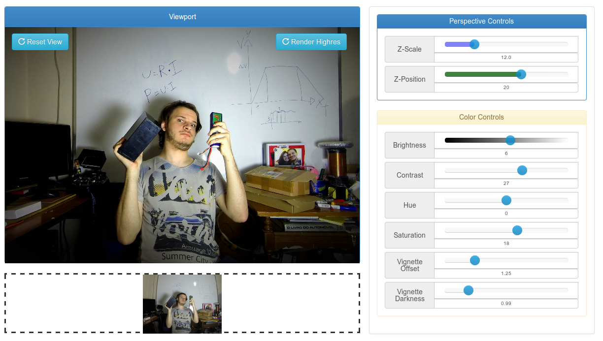
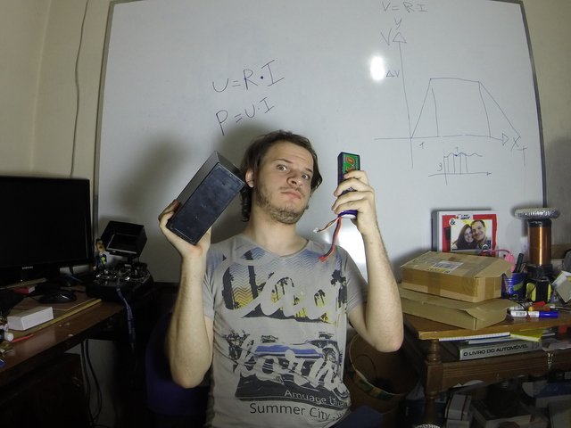
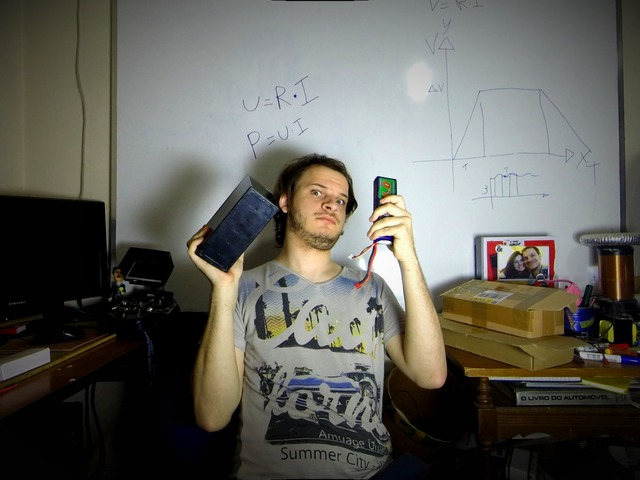

GoPro FIT
========

GoPro Online Lens Correction 

	__        _____ ____  
	\ \      / /_ _|  _ \ 
	 \ \ /\ / / | || |_) |
	  \ V  V /  | ||  __/ 
	   \_/\_/  |___|_|    
	                      

Uses: Three.JS , Bootstrap, Slider for Bootstrap

TODO: 
*	Better render - For now we have few issues in the output quality :/
*	Automatic Idealsize find
*	More image adjusts

Screenshot: 

Samples:

Used params: [a link](samples/params1.txt)
